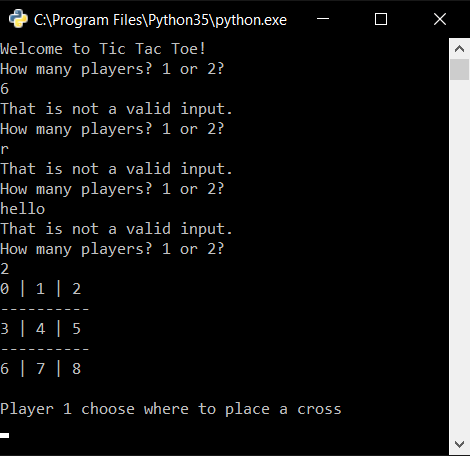
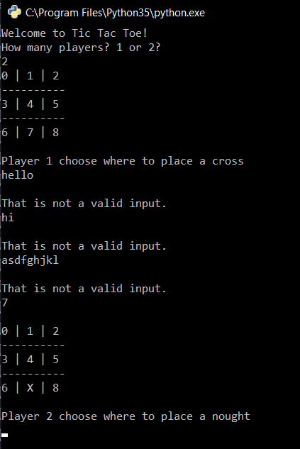
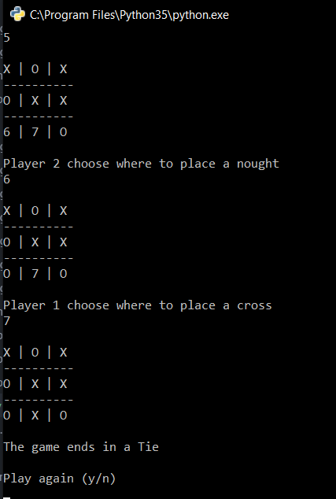

| Test ID | Description of test                                                                             | Test data                                                                                                                                                                                                                                             | Expected outcome                                                                                                                                                 | Actual outcome                                                                                                                                                                                                                         | Comments- Pass/Fail                                                                                                                                                                                            |
| ------- | ----------------------------------------------------------------------------------------------- | ----------------------------------------------------------------------------------------------------------------------------------------------------------------------------------------------------------------------------------------------------- | ---------------------------------------------------------------------------------------------------------------------------------------------------------------- | -------------------------------------------------------------------------------------------------------------------------------------------------------------------------------------------------------------------------------------- | -------------------------------------------------------------------------------------------------------------------------------------------------------------------------------------------------------------- |
| 1       | What occurs when the user inputs a invalid input when prompted to input the amount of players   | The while loop will be tested. The while loop contains an if statement which states if the users input is not 1 or 2, the program should output, that is not a valid input.                                                                           | The program should reject the user input if it is not equal to 1 or 2 and display a error message the while loop should repeat until they enter a valid input.   |  As expected, the code displays an error message prompts the user to enter their input again until they enter a valid inputs                                                                                             | Pass - The test successfully passes as it rejected any non valid inputs the user would enter and would keep prompting them to enter a valid input                                                              |
| 2       | What happens when the user enters a number out of range                                         | The while loop will be tested. The while loop contains an if statement which states if the users input is not in the range 0-8, the program should output, that is not a valid input.                                                                 | The program should reject the user input if it is out of range and display a error message the while loop should repeat until they enter a valid input.          |  As expected when the user attempts to enter a value that is not within the range 0-8, the program does not allow the input to be accepted and displays an error message, prompting the user to enter their input again. | Pass - The test successfully shows that when the user enters an input that is out of the range, the program will not accept the input and will ask the user to enter a valid input between the value 0-8.      |
| 3       | What happens when the user is prompoted to enter a tile number but they enter an invalid symbol | Here the while loop will be tested again but for non-integer, invalid values. The while loop contains an if statement so if the user enters an invalid value the program will output an error message and keep asking for a value that is valid.      | The program should reject the users input if it is invalid and should display an error message while running the while loop until the user enters a valid answer |  As expected when the user enters an invalid input, the program does not accept it and prompts the user to enter a valid inputs                                                                                          | Pass - the test shows that the program successfully rejected the users invalid input and prompted the user to enter a valid one until they acctually did. When they did, the program would continue as normal. |
| 4       | What occurs when the user enters a winning combination                                          | In this case the function will be tested to see if it works effectively in defining and implementing the winning combinations correctly in the program                                                                                                | The program should output a winning message to the user if they have a winning combination                                                                       |  As expected, when the user inputs a winning combination, the program outputs that the specific user has wonand adds 1to their score.                                                                                    | Pass - the test shows that when the user enters a winning combination, in this case (0,3,6), the program outputs that the user has won.                                                                        |
| 5       | What occurs when neither the computer nor the user wins the game                                | In this case the if statement regarding whether the user has a winning combination or not will be tested to see if it outputs that the game is a tie when all spaces are full and there are no winning combinations                                   | The program should output to the user that the game was a tie                                                                                                    |                                                                                                                                                                                                                          | Fail- The test shows that when the all the game tiles are occupied, the game doesnt end but keeps carrying on which it shouldnt do.                                                                            |
| 5.2     | What occurs when neither the computer nor the user wins the game                                | In the new version of the code I have added a new if statement which checks if the amount of turns is equal to 9. If its equal to 9 and there no winning combinations then the program will output to the user that the game is a tie.  | The program should now output to the user that the game was a tie.                                                                                               |                                                                                                                                                                                                                          | Pass- The game now successfully outputs whether the game is a tie if all tiles are occupied and there are no winning combinations                                                                              |
| 6       | What happens when one player wins 3 consecutive games in a row                                  | In this case the function containing a for loop which checks the board for a win will be tested. The global fucntion within the for loop will be tested.                                                                                              | The program should show that the user has 3 cummalative points.                                                                                                  |  As expected when the user wins 3 games, the score shown is 3.                                                                                                                                                           | Pass - The test showed that the program successfully accumalated all of the scores from the players and used the global function to keep the score going as more games were played.                                                                                                                                                                                                               |
