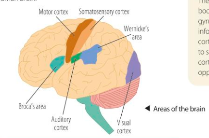

# Localisation of function

## A01

- Localisation is the principle that specific functions (language, memory, hearing, etc) have specific locations within the brain
- Gall's theory was that the structure of the skull would determine a person's character
- Using animal experimentation, it was discovered that the main divisions of the brain were responsible for different functions

#### Motor cortex

- Responsible for voluntary motor movements
- Located in the frontal lobe
- Both hemispheres have a motor cortex, with the side of the brain controlling muscles on the opposite side of the body.

#### Somatosensory cortex

- Detects sensory events from different regions of the body
- Located in parietal lobe
- Somatosensory cortex produces sensations of touch, pressure and pain which it then localises to specific body regions
- Both hemispheres have a Somatosensory cortex, with the side of the brain controlling muscles on the opposite side of the body.

#### Visual centres

- Primary visual centre is located in the visual cortex in the occipital lobe in the brain
- Visual processing begins in the retina (back of eye)
- Nerve impulses from the retina are transmitted via the optic nerve
- The visual cortex spans both hemispheres:
- The right hemisphere receives input from the left visual field, and the left hemisphere receives input from the right visual field

#### Auditory centres

- Auditory centre in the brain is concerned with hearing
- Area lies within the temporal lobes
- Sound impulses in the inner ear are converted to nerve impulses which travel via the auditory nerve to the auditory cortex in the brain
- It stops at the brain stem where decoding takes place (duration/intensity of sound)
- Then it stops at the thalamus which acts a relay station
- The last stop is the auditory cortex and it will respond accordingly.

#### Broca's Area
 - Area is named after a neurosurgeon who treated a patient which could only express one syllable
 - He could understand spoken language, but was unable to speak nor express their thoughts in writing
 - Broca studied 8 other patients which all had similar language deficits in **left** frontal hemisphere
 - Patients with damage to these areas in the right hemisphere did not have the same language problems
 - Led Broca to identify a language centre in the left hemispheres
 - Critical for speech production

#### Wernicke's areas

- Discovered another area of the brain for understanding
- Back of left temporal lobe
- Could speak but unable to understand language

## A03

- Lashley believed if an area of the brain was damaged, other areas of the cortex could take over
- Therefore the effect of brain damage would depend on extent rather than location
- Supported by the discovery that people can gain some cognitive abilities after damage so is somewhat flexible

***

- Wernicke believed that even though different regions of the brain have different functions, they are interdependent
- Case where reading skills were lost due to visual cortex and Wernicke's area being damaged
 - Suggests complex behaviours are built up gradually and moves through different structures before response is produced

***

- Bavelier found a large variety in individual patterns of activation across different individuals
- Observed activity in the lobes
-Other studies have significant gender differences in the size of the brain areas associated with language
- Woman have larger Broca's and Wernicke's areas than men

