# Development Phase

## Draft 1

### Draft 1 code

In my first draft of the code I have developed a few basic features.
I start by importing the random function, then defining the board as an empty array with numbers 0-8 in the array. I then define a function which checks the board for a win. The second function i implement is a function which lists all possible combinations of all wins possible. The first function uses the second function to determine a win. There is then an introduction to the game and then the main code starts off with a while loop. Inside the while loop, the user is asked to select a tile between 0 and 8 and it then converts it into an interger. I then defined an if statement which checks if the tile where the user wanted to place their shape already has a shape in it, if there is no shape on that tile then the program will place the shape there, however if there is a shape there then the statement outputs to the user that the spot is taken. After, another if statement will check if there is a win using the earlier defined function which lists all of the possible winning combinations. If the user has a winning combination, it will output to the user that they have won. A while loop then produces a random number between 0 and 8 for the computer to use as their tile selection. The program then runs an if statement to check if the tile which the computer generated to place their shape already has a shape on it. If there is no shape on the tle, the program places the shape there. If there is a shape already there, the while loop runs again to generate a new number. Another if statement is run to check if there is a win using the earlier defined function which lists all the wunning combinations. If the computer has a winning combinatin, it outputs that the computer has won.

### Running and trial of draft 1 code

In this trial of the game. The program introduced the game and then promopted me to select a tile. Upon selecting a tile, the program prompted me to select another and keeps going. The computer then stated I had won as I had a horizontal win.

In this trial of the game.The program introduced the  game and prompted me to select a tile. Once I selected a tile, when the program prompted me again, I entered the same number to see if my program would detect it as invalid. The program, as expected outputted that the spot was taken and prompted me to enter a valid input again.

### Evaluation of draft 1

Overall the program is extremely basic and is not completely robust. To improve my program, the next steps in my implementation would be to display a physical board to the user so they can visually see where they are placing their shapes. Also, a error message should be outputted whent he user types in an invalid input when asked where the would like to place their shape instead of the program just ending. I would also like to implement a choice for 2 players to play against eachother rather than 1 player against the computer.

## Draft 2

### Draft 2 code

 In my second draft it is similar to my first one but I changed certain aspects of the code. I started by importing the random function and then defining the board as an empty array with numbers 0-8. I then defined a function which checks the board for a win. The second function lists all possible combinations for a win. *I then defined a new function which was to create a visual board. It uses the array from before for this visual board.* I then implement an introduction which tells the user the game and what shape they will be and the next function will be the main code. The main code contains a while loop where the user is asked to select a tile and if the spot the user selects is not within the range then the program will print that its not a valid input. If the user does select an input thats within the range then the program will continue to an if statement which checks if the tile where the user wanted to place their shape is free. If there is no shape on that tile, the program places the shape there. If there is a shape there the else statement will output to the user that that spot is taken. The program will then check for a win using the earlier defined function which states all the possible combinations for a win. If the user has a winning combination, it will output to the user that they have won. If there is no winning combination, then the code will carry on to allow the computer to randomly generate a number between 0-8. The next if statement then checks that if the tile which the computer generated to place their shape is already taken. If the space is already taken, the code will run again to allow the computer to generate another random number between 0-8. Another if statement then runs to check whether the computer has won using the earlier defined function. If the computer has won the program will output that the computer has won. If there is no win then the game will keep looping until there is a win or a tie.

### Running and trial of draft 2 code

In this test, I tested whether the winning combination function worked. I made the user enter the winning combination (0,1,2) which produces a win in the top horizontal row. The program successfully outputed to the user that the user won

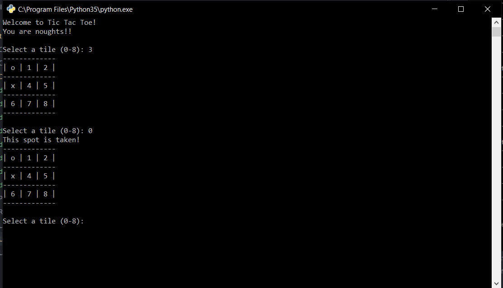

In this test, I tested whether the program would diallow the placement of a shape if there was already a shape on that tile. Following the test, I can conclude that when the user tried to place a shape in an already occupied space, the program will output that the spot is taken and and prompt the user to enter another tile number.

### Evaluation of draft 2

Overall my program is still basic and is still not robust but it now shows a physical board so the users can visually see where they are placing their shapes and wont have to remember where they have placed their shape. To further improve this program I would like to give the user an option at the start to enter how many players there are. If they enter '1' player, then the program will start the game with the user against the computer. If the user enters '2' players, then the program should start the game with player 1 against player 2.

## Draft 3

### Draft 3 code

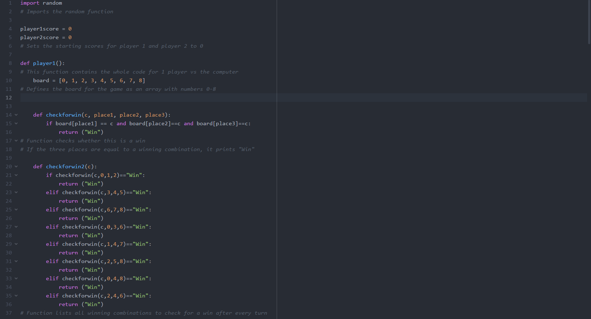

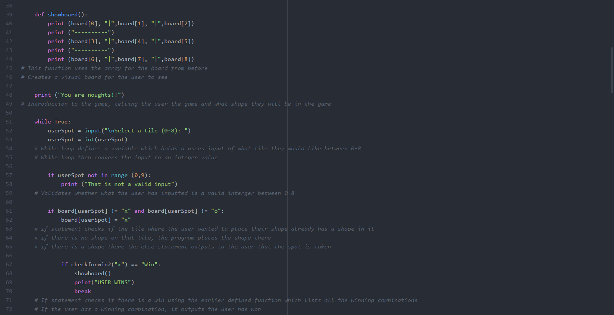

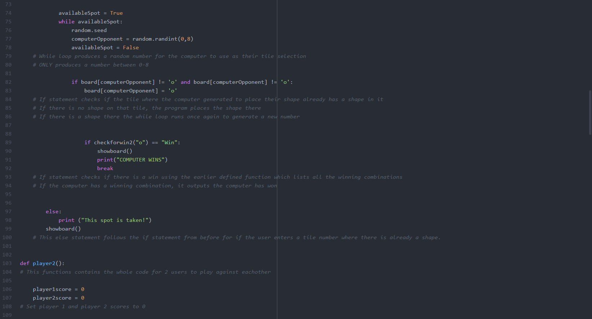

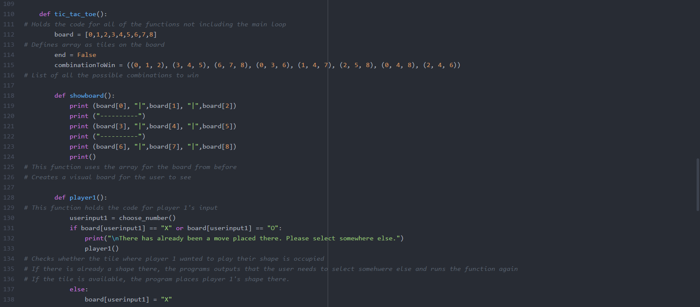

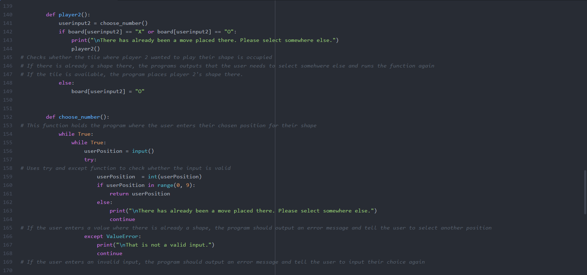

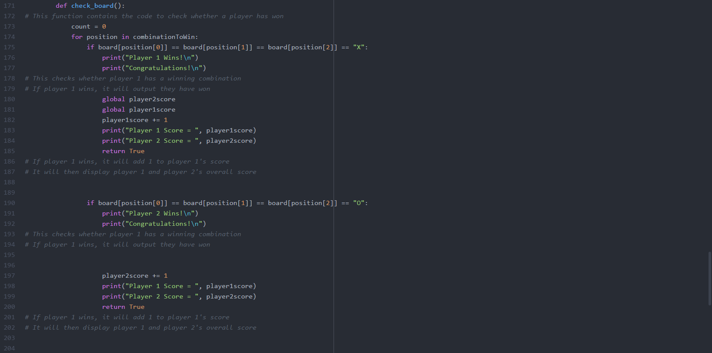

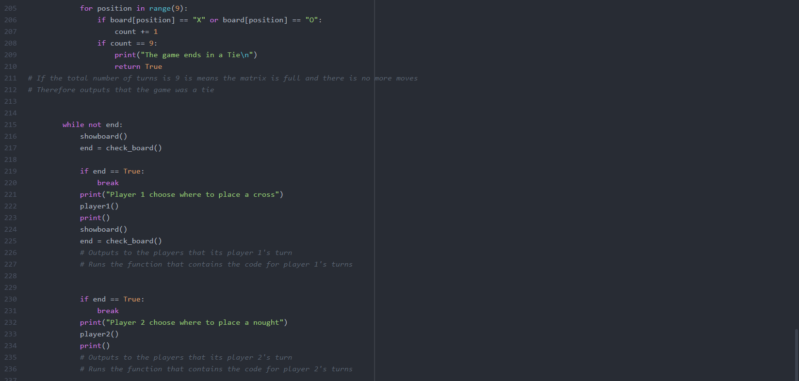

The final draft of the code starts off by importing the random function. Two variables are then definedt o hold player 1 and player 2's scores. The first function is then defined to hold the entire code for player 1 vs the computer. Within this function, I defined an array with numbers 0-8 which has the positions of the board. The next function then checks whether the user has a win by listing all possible combinations for a win. The next function defines a visual board using the array from before which shows the user where they are placing their shape. A while loop is then executed which holds the input for where the user would like to place their spot. The program then checks to see if the space os occupied or free. If the space is free, the program places the shape there. If it is taken, the program outputs that the spot is taken and promots the user to enter another tile space. The program then checks whether there is a win by the user using the earlier defined function. If there is a win by the user, the program will output there has been a win. If there is no win the game will carry on. A while loop is then executed to make the computer generate a random number between 0 and 8. The program then checks to see if that space is already taken. If it is already taken the program will keep generating a random number until it is already taken.

The next function defined contains the whole code for 2 ysers to play against eachother. It starts off by defining the 2 variables which hold the players score as 0. It then defines the whole game code holding an array which carrys the board numbers. It then  lists all combinations to win in a list. The next function defined is the visual board which holds the array before.
The next function holds the code for player 1's input. It asks player 1 to choose a tile number and checks whether there has already been a move placed there. If there is already a move there the program will output to player 2 that the spot is taken and prompt the user to enter a tile again. The next function holds the code for player 2's input. It asks player 2 to choose a tile number and checks whether there has already been a move placed there. If there is already a move there the program will output to player 2 that the spot is taken and prompt the user to enter a tile again. The next function defined is where the user chooses their number. This function is incorporated into the the player1 and player 2 function to allow them to choose their number. The last function is to check whether to player has won. It first checks whether player 1 has a winning combination, if player 1 has won, the program will output that player 1 has won and add 1 to their score. It then checks whether player 2 has a winning combination, if player 2 has won, the program will output that player 2 has won and add 1 to their score. If all tiles on the board are taken and there are no winning combinations, the program will output that the game is a tie. The program will then ask the user if they want to play again. If they dont want to play again the game will end, if they do the game will start again accumalating scores each round.

### Running and trial of draft 3 code

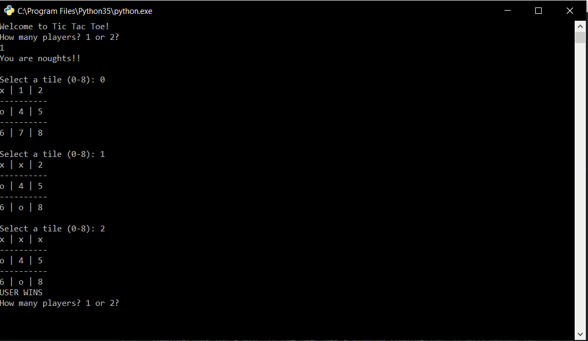

Here I tested whether the function containing the winning combinations worked. I made the user enter a winning combination (0,1,2)  which produces a win at the top of the board. The program then outputted that the user won.

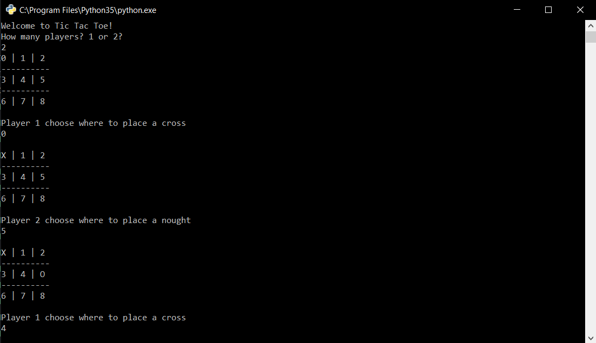

Here I tested whether the new function where 2 players can play at a time worked. I tested whether when the user entered a space to place their shape it would actually place it there. The program successfully placed the shapes in the player's desired spots.

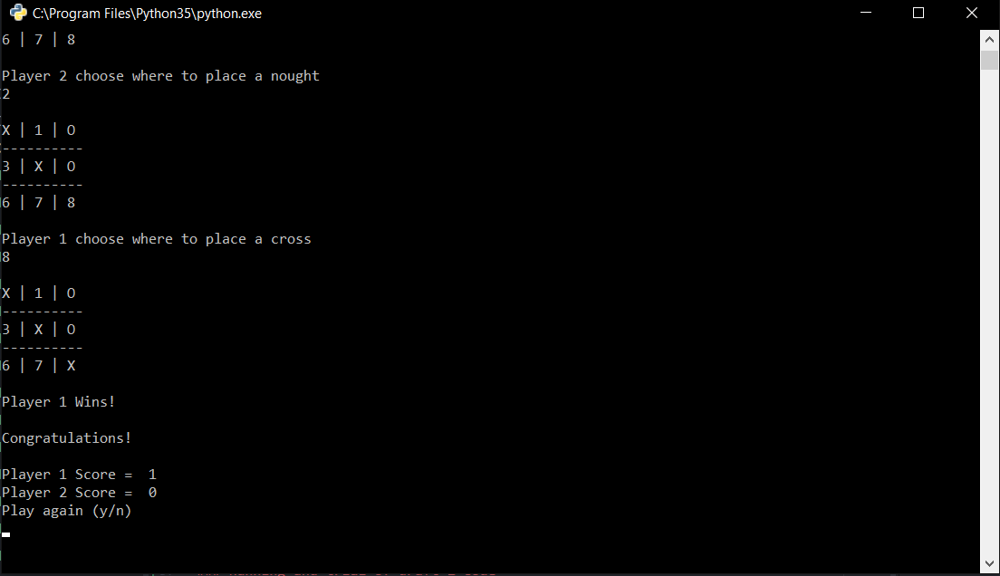

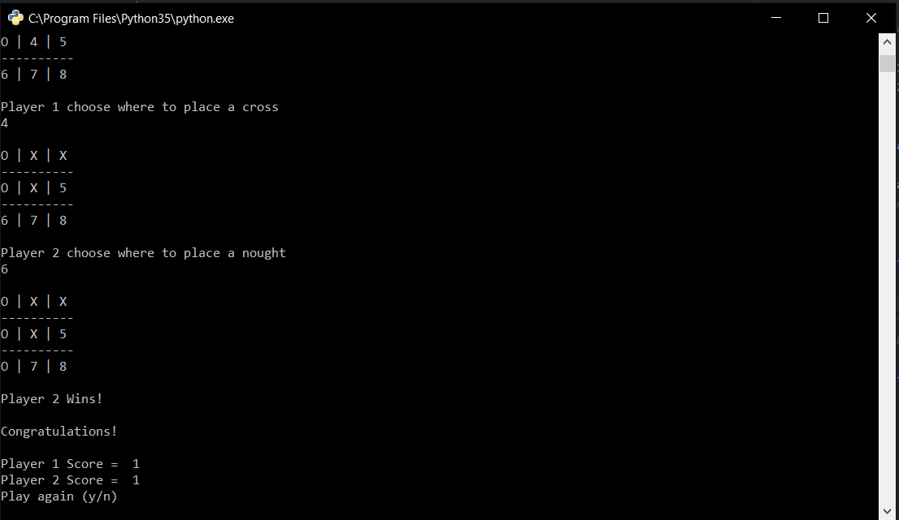

Here, I tested whether the program was able to effectively distribute scores to the correct players. The program was able to assign points and store them for next games use.

### Evaluation of draft 3

Overall my prograam had advanced from the start. It is robust and disallows any type of invalid input by any of the users. The program has a physical board which can allow users to visually see the board, where they are placing their shapes, and where their opponent had placed their tiles. The program also has a new function which allows the player to select if there are 1 or 2 players playing. If there is 1 player, the program will launch into a game with the user against the computer. If there is 2 players, the program will launch into a game where the 2 players can play against eachother.
