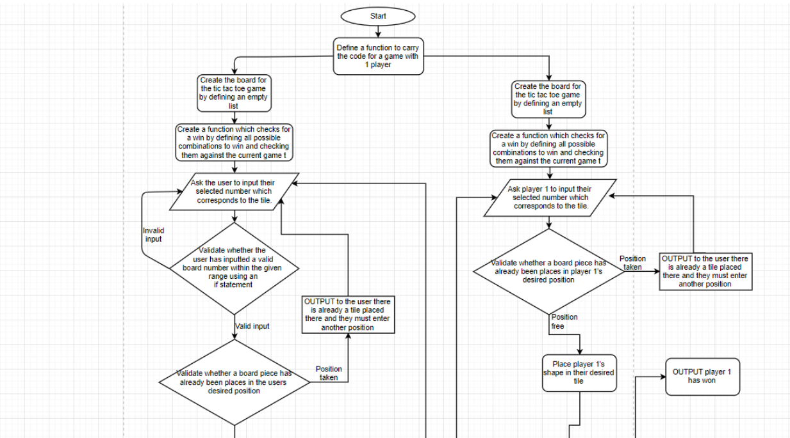
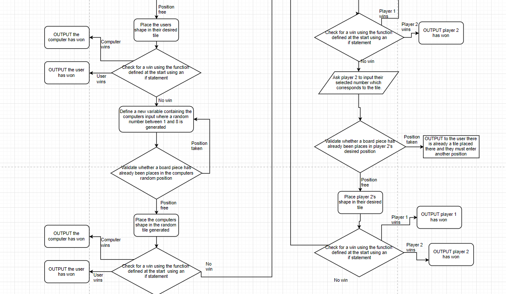

# Tic Tac Toe Challenge

## Planning Phase

### Rules

The objective of the game is to place 3 of your shape (either noughts or crosses) in a straight line which could either go horizontally, vertically or diagonally to win. The two people playing will have to decide who will go first.
The first player will place their shape on an empty square on a 3x3 grid. Then player 2 will have their go. A shape cannot be placed where another shape already is.
This continues until either player 1 or player 2 has made a straight line with their shape either horizontally, vertically, or diagonally.

### In my program I will implement

#### Variables and constants
- Two functions for two types of games. The first function will contain the code for one user to play against the computer. The second function will contain the code for two users to play against eachother

###### In the function for the one player vs the computer game:
- I will define the 'board' for the game as an empty array.
- I will have an initialising function which will state all the possible combinations needed to win. This can later be implemented within the main code to check if a user has won after  every move.
- I will have a second function which will output a visual board to the user incorporating the original array of the board so the 'tiles' where the users place their shapes corrosponds with one another
- A variable which stores the user input on where they would like to place their shape. The variable will be a interger value as the user will input a number from 0-8 which will corrospond with the virtual board. This variable will be encased ina  while loop to ensure that the input the user is entering is valid.
- The program will then use the users input to check whether there is already a shape in the users desired place. If not, the program will place the shape there, if there is already a shape there, the program will output to the user to select another tile as the one they originally wanted is occupied.
- There will be another variable that will check whether there is a win after every move placed. As soon as a move has been put down by either the user or the computer, the program will check if there is a win by calling the function defined at the beginning which states all possible combinations to win. If there are no wins, the game will carry on until there is a win. If the user has won, the program will output that the user has won, if the computer has won, the program will output that the computer has won.

###### In the function for the one player vs the second player:

- At the beginning I will define two functions which will contain the scores for player 1 and player 2
- I will then create a function which encloses all of the possible combinations to win the game which can be used later to check whether a user has one after every move.
- I will then define a function which shows a visual board with numbers on each tile so the user knows what number corrosponds to which space.
- I will then create a function for the first player which encloses the code for their 'turn' in the game. Within this function it will contain a variable which holds the users chosen number. It will then check whether there is already a shape in that tile, if not the program will place the users shape in that tile. If that space is occupied, it will state to the use that the space is already occupied and will prompt them to enter another tile space.
- I will then create another function for the second player which is the same as the function for the first user except it uses the variables for player 2. The function encloses the code for their 'turn' in the game.
- I will then define another function will contains the code for the user to choose their number. It will ask the user for a position from 0-8 which corrosponds with the board.
- Then, I will define another function which checks the board to see if there is a win. It checks the board against player 1's shape, if player 1 has won, the program will output that player 1 has won and will add one to player 1 score. If player 1 hasn't won, the program will check the board against player 2's shape, if player 2 has won, the program will output that player 2 has won and will add one to player 2's score. If no one has won, the program will keep going until there is a win. The program will check if 9 moves have been played (which indicates that all tiles are full) and if there are no wins, the program will output that the game was a tie.
- At the end of each game, the program will ask the user if they want to play again, if they said yes, the program will repeat. If they say no, the program will end.

#### User interface
The user will interact with the program in numerous ways;
- When the program is first launched, the program requires the user to interact with it by inputting the amount of players there are.
- A user will then see a visual board containing a 3x3 matrix which contains number from 0-8 which corrosponds to a tile.
- When a user is selecting their tile to place their shape on, they are required to interact with the program when inputting their number which corrosponds with the tile.
- Interaction is also required at the end of the program when the user is asked if they want to play the game again. If the user enters yes to play again, the program will restart, if not the program will end.

### Design the algorithm as a flowchart

### TEST PLAN:

| Test ID | Description of test                                                                             | Test data                                                                                                                                                                                                                                        | Expected outcome                                                                                                                                                 | Actual outcome | Comments |
| ------- | ----------------------------------------------------------------------------------------------- | ------------------------------------------------------------------------------------------------------------------------------------------------------------------------------------------------------------------------------------------------ | ---------------------------------------------------------------------------------------------------------------------------------------------------------------- | -------------- | -------- |
| 1       | What occurs when the user inputs a invalid input when prompted to input the amount of players   | The while loop will be tested. The while loop contains an if statement which states if the users input is not 1 or 2, the program should output, that is not a valid input.                                                                      | The program should reject the user input if it is not equal to 1 or 2 and display a error message the while loop should repeat until they enter a valid input.   | ***            | ***      |
| 2       | What happens when the user enters a number out of range                                         | The while loop will be tested. The while loop contains an if statement which states if the users input is not in the range 0-9, the program should output, that is not a valid input.                                                            | The program should reject the user input if it is out of range and display a error message the while loop should repeat until they enter a valid input.          | ***            | ***      |
| 3       | What happens when the user is prompoted to enter a tile number but they enter an invalid symbol | Here the while loop will be tested again but for non-integer, invalid values. The while loop contains an if statement so if the user enters an invalid value the program will output an error message and keep asking for a value that is valid. | The program should reject the users input if it is invalid and should display an error message while running the while loop until the user enters a valid answer | ***            | ***      |
| 4       | What occurs when the user enters a winning combination                                          | In this case the function will be tested to see if it works effectively in defining and implementing the winning combinations correctly in the program                                                                                           | The program should output a winning message to the user if they have a winning combination                                                                       | ***            | ***      |
| 5       | What occurs when neither the computer not the user wins the game                                | In this case the if statement regarding whether the user has a winning combination or not will be tested to see if it outputs that the game is a tie when all spaces are full and there are no winning combinations                              | The program should output to the user that the game was a tile                                                                                                   | ***            | ***         |
=======
# Tic Tac Toe Challenge

## Planning Phase

### Rules

The objective of the game is to place 3 of your shape (either noughts or crosses) in a straight line which could either go horizontally, vertically or diagonally to win. The two people playing will have to decide who will go first.
The first player will place their shape on an empty square on a 3x3 grid. Then player 2 will have their go. A shape cannot be placed where another shape already is.
This continues until either player 1 or player 2 has made a straight line with their shape either horizontally, vertically, or diagonally. It can also end if all tiles on the board are full, this would be called a 'tie'

### In my program I will implement#

#### Variables and constants
- Two functions for two types of games. The first function will contain the code for one user to play against the computer. The second function will contain the code for two users to play against eachother

###### In the function for the one player vs the computer game:
- I will define the 'board' for the game as an empty array.
- I will have an initialising function which will state all the possible combinations needed to win. This can later be implemented within the main code to check if a user has won after  every move.
- I will have a second function which will output a visual board to the user incorporating the original array of the board so the 'tiles' where the users place their shapes corrosponds with one another
- A variable which stores the user input on where they would like to place their shape. The variable will be a interger value as the user will input a number from 0-8 which will corrospond with the virtual board. This variable will be encased ina  while loop to ensure that the input the user is entering is valid.
- The program will then use the users input to check whether there is already a shape in the users desired place. If not, the program will place the shape there, if there is already a shape there, the program will output to the user to select another tile as the one they originally wanted is occupied.
- There will be another variable that will check whether there is a win after every move placed. As soon as a move has been put down by either the user or the computer, the program will check if there is a win by calling the function defined at the beginning which states all possible combinations to win. If there are no wins, the game will carry on until there is a win. If the user has won, the program will output that the user has won, if the computer has won, the program will output that the computer has won.

###### In the function for the one player vs the second player:

- At the beginning I will define two functions which will contain the scores for player 1 and player 2
- I will then create a function which encloses all of the possible combinations to win the game which can be used later to check whether a user has one after every move.
- I will then define a function which shows a visual board with numbers on each tile so the user knows what number corrosponds to which space.
- I will then create a function for the first player which encloses the code for their 'turn' in the game. Within this function it will contain a variable which holds the users chosen number. It will then check whether there is already a shape in that tile, if not the program will place the users shape in that tile. If that space is occupied, it will state to the use that the space is already occupied and will prompt them to enter another tile space.
- I will then create another function for the second player which is the same as the function for the first user except it uses the variables for player 2. The function encloses the code for their 'turn' in the game.
- I will then define another function will contains the code for the user to choose their number. It will ask the user for a position from 0-8 which corrosponds with the board.
- Then, I will define another function which checks the board to see if there is a win. It checks the board against player 1's shape, if player 1 has won, the program will output that player 1 has won and will add one to player 1 score. If player 1 hasn't won, the program will check the board against player 2's shape, if player 2 has won, the program will output that player 2 has won and will add one to player 2's score. If no one has won, the program will keep going until there is a win. The program will check if 9 moves have been played (which indicates that all tiles are full) and if there are no wins, the program will output that the game was a tie.
- At the end of each game, the program will ask the user if they want to play again, if they said yes, the program will repeat. If they say no, the program will end.

#### User interface
The user will interact with the program in numerous ways;
- When the program is first launched, the program requires the user to interact with it by inputting the amount of players there are.
- A user will then see a visual board containing a 3x3 matrix which contains number from 0-8 which corrosponds to a tile.
- When a user is selecting their tile to place their shape on, they are required to interact with the program when inputting their number which corrosponds with the tile.
- Interaction is also required at the end of the program when the user is asked if they want to play the game again. If the user enters yes to play again, the program will restart, if not the program will end.

### Design the algorithm as a flowchart

### TEST PLAN:

| Test ID | Description of test                                                                             | Test data                                                                                                                                                                                                                                        | Expected outcome                                                                                                                                                 | Actual outcome | Comments |
| ------- | ----------------------------------------------------------------------------------------------- | ------------------------------------------------------------------------------------------------------------------------------------------------------------------------------------------------------------------------------------------------ | ---------------------------------------------------------------------------------------------------------------------------------------------------------------- | -------------- | -------- |
| 1       | What occurs when the user inputs a invalid input when prompted to input the amount of players   | The while loop will be tested. The while loop contains an if statement which states if the users input is not 1 or 2, the program should output, that is not a valid input.                                                                      | The program should reject the user input if it is not equal to 1 or 2 and display a error message the while loop should repeat until they enter a valid input.   | ***            | ***      |
| 2       | What happens when the user enters a number out of range                                         | The while loop will be tested. The while loop contains an if statement which states if the users input is not in the range 0-9, the program should output, that is not a valid input.                                                            | The program should reject the user input if it is out of range and display a error message the while loop should repeat until they enter a valid input.          | ***            | ***      |
| 3       | What happens when the user is prompoted to enter a tile number but they enter an invalid symbol | Here the while loop will be tested again but for non-integer, invalid values. The while loop contains an if statement so if the user enters an invalid value the program will output an error message and keep asking for a value that is valid. | The program should reject the users input if it is invalid and should display an error message while running the while loop until the user enters a valid answer | ***            | ***      |
| 4       | What occurs when the user enters a winning combination                                          | In this case the function will be tested to see if it works effectively in defining and implementing the winning combinations correctly in the program                                                                                           | The program should output a winning message to the user if they have a winning combination                                                                       | ***            | ***      |
| 5       | What occurs when neither the computer not the user wins the game                                | In this case the if statement regarding whether the user has a winning combination or not will be tested to see if it outputs that the game is a tie when all spaces are full and there are no winning combinations                              | The program should output to the user that the game was a tile                                                                                                   | ***            | ***         |
>>>>>>> before discard
