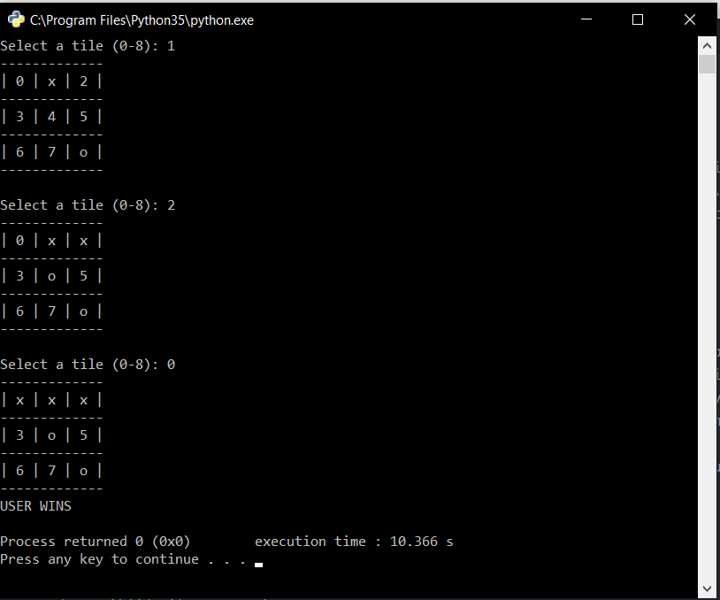
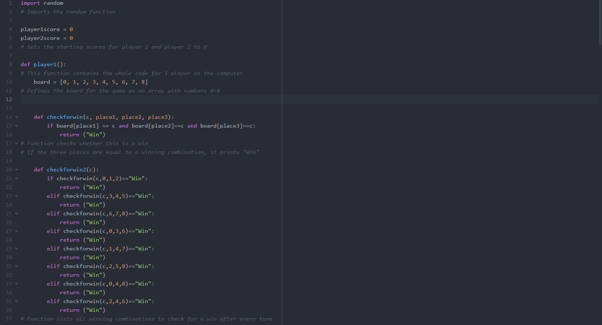
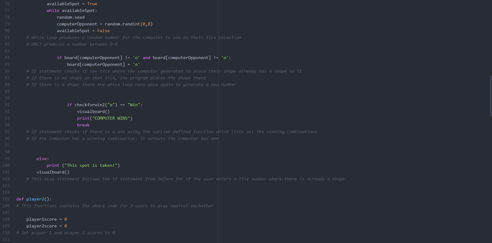
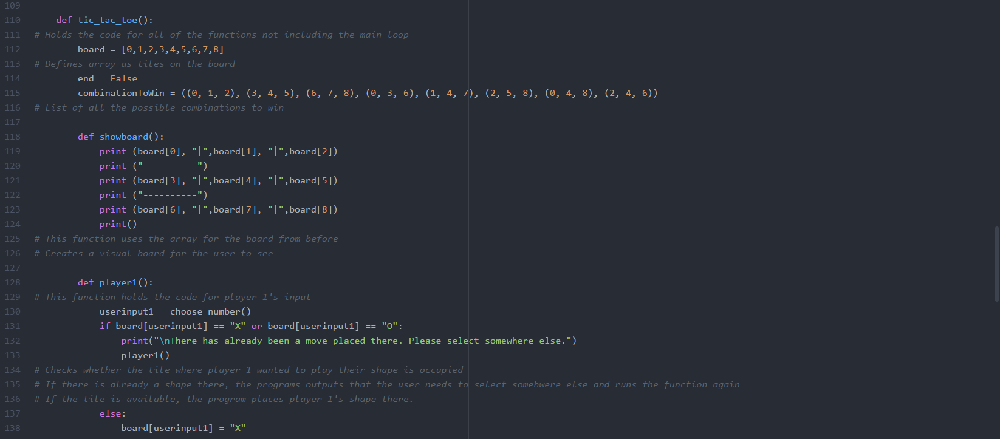
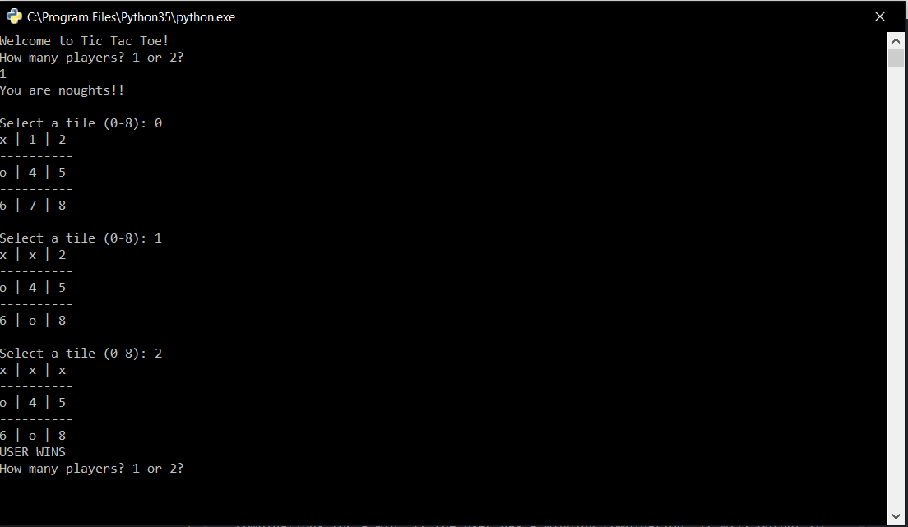
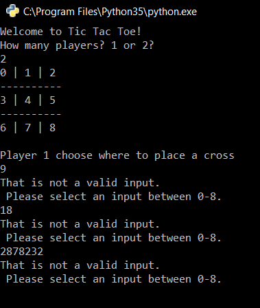
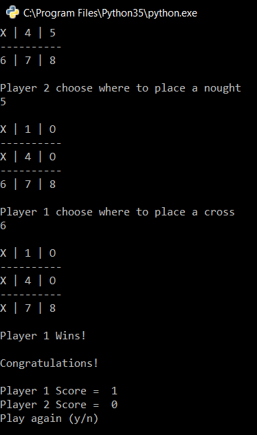
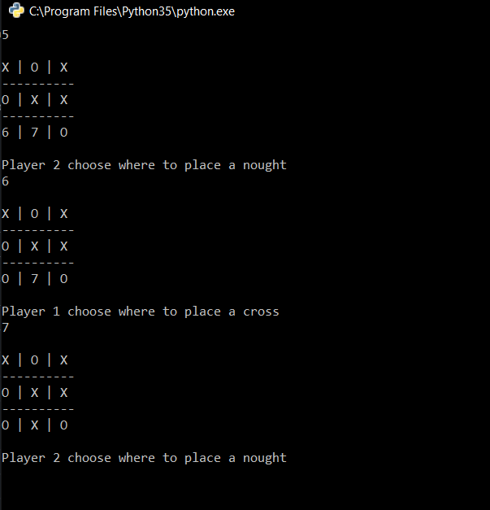
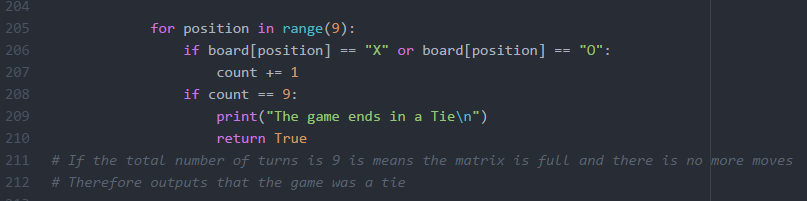
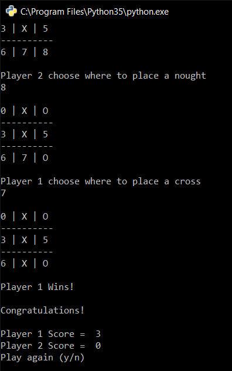

# Unit 1 - Tic Tac Toe Challenge

## Planning Phase

### Rules

The objective of the game is to place 3 of your shape (either noughts or crosses) in a straight line which could either go horizontally, vertically or diagonally to win. The two people playing will have to decide who will go first.
The first player will place their shape on an empty square on a 3x3 grid. Then player 2 will have their go. A shape cannot be placed where another shape already is.
This continues until either player 1 or player 2 has made a straight line with their shape either horizontally, vertically, or diagonally.

### In my program I will implement

#### Variables and constants
- Two functions for two types of games. The first function will contain the code for one user to play against the computer. The second function will contain the code for two users to play against eachother

###### In the function for the one player vs the computer game:
- I will define the 'board' for the game as an empty array.
- I will have an initialising function which will state all the possible combinations needed to win. This can later be implemented within the main code to check if a user has won after  every move.
- I will have a second function which will output a visual board to the user incorporating the original array of the board so the 'tiles' where the users place their shapes corrosponds with one another
- A variable which stores the user input on where they would like to place their shape. The variable will be a interger value as the user will input a number from 0-8 which will corrospond with the virtual board. This variable will be encased ina  while loop to ensure that the input the user is entering is valid.
- The program will then use the users input to check whether there is already a shape in the users desired place. If not, the program will place the shape there, if there is already a shape there, the program will output to the user to select another tile as the one they originally wanted is occupied.
- There will be another variable that will check whether there is a win after every move placed. As soon as a move has been put down by either the user or the computer, the program will check if there is a win by calling the function defined at the beginning which states all possible combinations to win. If there are no wins, the game will carry on until there is a win. If the user has won, the program will output that the user has won, if the computer has won, the program will output that the computer has won.

###### In the function for the one player vs the second player:

- At the beginning I will define two functions which will contain the scores for player 1 and player 2
- I will then create a function which encloses all of the possible combinations to win the game which can be used later to check whether a user has one after every move.
- I will then define a function which shows a visual board with numbers on each tile so the user knows what number corrosponds to which space.
- I will then create a function for the first player which encloses the code for their 'turn' in the game. Within this function it will contain a variable which holds the users chosen number. It will then check whether there is already a shape in that tile, if not the program will place the users shape in that tile. If that space is occupied, it will state to the use that the space is already occupied and will prompt them to enter another tile space.
- I will then create another function for the second player which is the same as the function for the first user except it uses the variables for player 2. The function encloses the code for their 'turn' in the game.
- I will then define another function will contains the code for the user to choose their number. It will ask the user for a position from 0-8 which corrosponds with the board.
- Then, I will define another function which checks the board to see if there is a win. It checks the board against player 1's shape, if player 1 has won, the program will output that player 1 has won and will add one to player 1 score. If player 1 hasn't won, the program will check the board against player 2's shape, if player 2 has won, the program will output that player 2 has won and will add one to player 2's score. If no one has won, the program will keep going until there is a win. The program will check if 9 moves have been played (which indicates that all tiles are full) and if there are no wins, the program will output that the game was a tie.
- At the end of each game, the program will ask the user if they want to play again, if they said yes, the program will repeat. If they say no, the program will end.

#### User interface
The user will interact with the program in numerous ways;
- When the program is first launched, the program requires the user to interact with it by inputting the amount of players there are.
- A user will then see a visual board containing a 3x3 matrix which contains number from 0-8 which corrosponds to a tile.
- When a user is selecting their tile to place their shape on, they are required to interact with the program when inputting their number which corrosponds with the tile.
- Interaction is also required at the end of the program when the user is asked if they want to play the game again. If the user enters yes to play again, the program will restart, if not the program will end.

### Design the algorithm as a flowchart

### TEST PLAN:

| Test ID | Description of test                                                                             | Test data                                                                                                                                                                                                                                        | Expected outcome                                                                                                                                                 | Actual outcome | Comments |
| ------- | ----------------------------------------------------------------------------------------------- | ------------------------------------------------------------------------------------------------------------------------------------------------------------------------------------------------------------------------------------------------ | ---------------------------------------------------------------------------------------------------------------------------------------------------------------- | -------------- | -------- |
| 1       | What occurs when the user inputs a invalid input when prompted to input the amount of players   | The while loop will be tested. The while loop contains an if statement which states if the users input is not 1 or 2, the program should output, that is not a valid input.                                                                      | The program should reject the user input if it is not equal to 1 or 2 and display a error message the while loop should repeat until they enter a valid input.   | ***            | ***      |
| 2       | What happens when the user enters a number out of range                                         | The while loop will be tested. The while loop contains an if statement which states if the users input is not in the range 0-9, the program should output, that is not a valid input.                                                            | The program should reject the user input if it is out of range and display a error message the while loop should repeat until they enter a valid input.          | ***            | ***      |
| 3       | What happens when the user is prompoted to enter a tile number but they enter an invalid symbol | Here the while loop will be tested again but for non-integer, invalid values. The while loop contains an if statement so if the user enters an invalid value the program will output an error message and keep asking for a value that is valid. | The program should reject the users input if it is invalid and should display an error message while running the while loop until the user enters a valid answer | ***            | ***      |
| 4       | What occurs when the user enters a winning combination                                          | In this case the function will be tested to see if it works effectively in defining and implementing the winning combinations correctly in the program                                                                                           | The program should output a winning message to the user if they have a winning combination                                                                       | ***            | ***      |
| 5       | What occurs when neither the computer not the user wins the game                                | In this case the if statement regarding whether the user has a winning combination or not will be tested to see if it outputs that the game is a tie when all spaces are full and there are no winning combinations                              | The program should output to the user that the game was a tile                                                                                                   | ***            | ***         |

# Development Phase

## Draft 1

### Draft 1 code

In my first draft of the code I have developed a few basic features.
I start by importing the random function, then defining the board as an empty array with numbers 0-8 in the array. I then define a function which checks the board for a win. The second function i implement is a function which lists all possible combinations of all wins possible. The first function uses the second function to determine a win. There is then an introduction to the game and then the main code starts off with a while loop. Inside the while loop, the user is asked to select a tile between 0 and 8 and it then converts it into an interger. I then defined an if statement which checks if the tile where the user wanted to place their shape already has a shape in it, if there is no shape on that tile then the program will place the shape there, however if there is a shape there then the statement outputs to the user that the spot is taken. After, another if statement will check if there is a win using the earlier defined function which lists all of the possible winning combinations. If the user has a winning combination, it will output to the user that they have won. A while loop then produces a random number between 0 and 8 for the computer to use as their tile selection. The program then runs an if statement to check if the tile which the computer generated to place their shape already has a shape on it. If there is no shape on the tle, the program places the shape there. If there is a shape already there, the while loop runs again to generate a new number. Another if statement is run to check if there is a win using the earlier defined function which lists all the wunning combinations. If the computer has a winning combinatin, it outputs that the computer has won.

### Running and trial of draft 1 code

In this trial of the game. The program introduced the game and then promopted me to select a tile. Upon selecting a tile, the program prompted me to select another and keeps going. The computer then stated I had won as I had a horizontal win.

In this trial of the game.The program introduced the  game and prompted me to select a tile. Once I selected a tile, when the program prompted me again, I entered the same number to see if my program would detect it as invalid. The program, as expected outputted that the spot was taken and prompted me to enter a valid input again.

### Evaluation of draft 1

Overall the program is extremely basic and is not completely robust. To improve my program, the next steps in my implementation would be to display a physical board to the user so they can visually see where they are placing their shapes. Also, a error message should be outputted whent he user types in an invalid input when asked where the would like to place their shape instead of the program just ending. I would also like to implement a choice for 2 players to play against eachother rather than 1 player against the computer.

## Draft 2

### Draft 2 code

 In my second draft it is similar to my first one but I changed certain aspects of the code. I started by importing the random function and then defining the board as an empty array with numbers 0-8. I then defined a function which checks the board for a win. The second function lists all possible combinations for a win. *I then defined a new function which was to create a visual board. It uses the array from before for this visual board.* I then implement an introduction which tells the user the game and what shape they will be and the next function will be the main code. The main code contains a while loop where the user is asked to select a tile and if the spot the user selects is not within the range then the program will print that its not a valid input. If the user does select an input thats within the range then the program will continue to an if statement which checks if the tile where the user wanted to place their shape is free. If there is no shape on that tile, the program places the shape there. If there is a shape there the else statement will output to the user that that spot is taken. The program will then check for a win using the earlier defined function which states all the possible combinations for a win. If the user has a winning combination, it will output to the user that they have won. If there is no winning combination, then the code will carry on to allow the computer to randomly generate a number between 0-8. The next if statement then checks that if the tile which the computer generated to place their shape is already taken. If the space is already taken, the code will run again to allow the computer to generate another random number between 0-8. Another if statement then runs to check whether the computer has won using the earlier defined function. If the computer has won the program will output that the computer has won. If there is no win then the game will keep looping until there is a win or a tie.

### Running and trial of draft 2 code

In this test, I tested whether the winning combination function worked. I made the user enter the winning combination (0,1,2) which produces a win in the top horizontal row. The program successfully outputed to the user that the user won

In this test, I tested whether the program would diallow the placement of a shape if there was already a shape on that tile. Following the test, I can conclude that when the user tried to place a shape in an already occupied space, the program will output that the spot is taken and and prompt the user to enter another tile number.

### Evaluation of draft 2

Overall my program is still basic and is still not robust but it now shows a physical board so the users can visually see where they are placing their shapes and wont have to remember where they have placed their shape. To further improve this program I would like to give the user an option at the start to enter how many players there are. If they enter '1' player, then the program will start the game with the user against the computer. If the user enters '2' players, then the program should start the game with player 1 against player 2.

## Draft 3

### Draft 3 code

The final draft of the code starts off by importing the random function. Two variables are then definedt o hold player 1 and player 2's scores. The first function is then defined to hold the entire code for player 1 vs the computer. Within this function, I defined an array with numbers 0-8 which has the positions of the board. The next function then checks whether the user has a win by listing all possible combinations for a win. The next function defines a visual board using the array from before which shows the user where they are placing their shape. A while loop is then executed which holds the input for where the user would like to place their spot. The program then checks to see if the space os occupied or free. If the space is free, the program places the shape there. If it is taken, the program outputs that the spot is taken and promots the user to enter another tile space. The program then checks whether there is a win by the user using the earlier defined function. If there is a win by the user, the program will output there has been a win. If there is no win the game will carry on. A while loop is then executed to make the computer generate a random number between 0 and 8. The program then checks to see if that space is already taken. If it is already taken the program will keep generating a random number until it is already taken.

The next function defined contains the whole code for 2 ysers to play against eachother. It starts off by defining the 2 variables which hold the players score as 0. It then defines the whole game code holding an array which carrys the board numbers. It then  lists all combinations to win in a list. The next function defined is the visual board which holds the array before.
The next function holds the code for player 1's input. It asks player 1 to choose a tile number and checks whether there has already been a move placed there. If there is already a move there the program will output to player 2 that the spot is taken and prompt the user to enter a tile again. The next function holds the code for player 2's input. It asks player 2 to choose a tile number and checks whether there has already been a move placed there. If there is already a move there the program will output to player 2 that the spot is taken and prompt the user to enter a tile again. The next function defined is where the user chooses their number. This function is incorporated into the the player1 and player 2 function to allow them to choose their number. The last function is to check whether to player has won. It first checks whether player 1 has a winning combination, if player 1 has won, the program will output that player 1 has won and add 1 to their score. It then checks whether player 2 has a winning combination, if player 2 has won, the program will output that player 2 has won and add 1 to their score. If all tiles on the board are taken and there are no winning combinations, the program will output that the game is a tie. The program will then ask the user if they want to play again. If they dont want to play again the game will end, if they do the game will start again accumalating scores each round.

### Running and trial of draft 3 code

Here I tested whether the function containing the winning combinations worked. I made the user enter a winning combination (0,1,2)  which produces a win at the top of the board. The program then outputted that the user won.

Here I tested whether the new function where 2 players can play at a time worked. I tested whether when the user entered a space to place their shape it would actually place it there. The program successfully placed the shapes in the player's desired spots.

Here, I tested whether the program was able to effectively distribute scores to the correct players. The program was able to assign points and store them for next games use.

### Evaluation of draft 3

Overall my prograam had advanced from the start. It is robust and disallows any type of invalid input by any of the users. The program has a physical board which can allow users to visually see the board, where they are placing their shapes, and where their opponent had placed their tiles. The program also has a new function which allows the player to select if there are 1 or 2 players playing. If there is 1 player, the program will launch into a game with the user against the computer. If there is 2 players, the program will launch into a game where the 2 players can play against eachother.

| Test ID | Description of test                                                                             | Test data                                                                                                                                                                                                                                             | Expected outcome                                                                                                                                                 | Actual outcome                                                                                                                                                                                                                         | Comments- Pass/Fail                                                                                                                                                                                            |
| ------- | ----------------------------------------------------------------------------------------------- | ----------------------------------------------------------------------------------------------------------------------------------------------------------------------------------------------------------------------------------------------------- | ---------------------------------------------------------------------------------------------------------------------------------------------------------------- | -------------------------------------------------------------------------------------------------------------------------------------------------------------------------------------------------------------------------------------- | -------------------------------------------------------------------------------------------------------------------------------------------------------------------------------------------------------------- |
| 1       | What occurs when the user inputs a invalid input when prompted to input the amount of players   | The while loop will be tested. The while loop contains an if statement which states if the users input is not 1 or 2, the program should output, that is not a valid input.                                                                           | The program should reject the user input if it is not equal to 1 or 2 and display a error message the while loop should repeat until they enter a valid input.   |  As expected, the code displays an error message prompts the user to enter their input again until they enter a valid inputs                                                                                             | Pass - The test successfully passes as it rejected any non valid inputs the user would enter and would keep prompting them to enter a valid input                                                              |
| 2       | What happens when the user enters a number out of range                                         | The while loop will be tested. The while loop contains an if statement which states if the users input is not in the range 0-8, the program should output, that is not a valid input.                                                                 | The program should reject the user input if it is out of range and display a error message the while loop should repeat until they enter a valid input.          |  As expected when the user attempts to enter a value that is not within the range 0-8, the program does not allow the input to be accepted and displays an error message, prompting the user to enter their input again. | Pass - The test successfully shows that when the user enters an input that is out of the range, the program will not accept the input and will ask the user to enter a valid input between the value 0-8.      |
| 3       | What happens when the user is prompoted to enter a tile number but they enter an invalid symbol | Here the while loop will be tested again but for non-integer, invalid values. The while loop contains an if statement so if the user enters an invalid value the program will output an error message and keep asking for a value that is valid.      | The program should reject the users input if it is invalid and should display an error message while running the while loop until the user enters a valid answer |  As expected when the user enters an invalid input, the program does not accept it and prompts the user to enter a valid inputs                                                                                          | Pass - the test shows that the program successfully rejected the users invalid input and prompted the user to enter a valid one until they acctually did. When they did, the program would continue as normal. |
| 4       | What occurs when the user enters a winning combination                                          | In this case the function will be tested to see if it works effectively in defining and implementing the winning combinations correctly in the program                                                                                                | The program should output a winning message to the user if they have a winning combination                                                                       |  As expected, when the user inputs a winning combination, the program outputs that the specific user has wonand adds 1to their score.                                                                                    | Pass - the test shows that when the user enters a winning combination, in this case (0,3,6), the program outputs that the user has won.                                                                        |
| 5       | What occurs when neither the computer nor the user wins the game                                | In this case the if statement regarding whether the user has a winning combination or not will be tested to see if it outputs that the game is a tie when all spaces are full and there are no winning combinations                                   | The program should output to the user that the game was a tie                                                                                                    |                                                                                                                                                                                                                          | Fail- The test shows that when the all the game tiles are occupied, the game doesnt end but keeps carrying on which it shouldnt do.                                                                            |
| 5.2     | What occurs when neither the computer nor the user wins the game                                | In the new version of the code I have added a new if statement which checks if the amount of turns is equal to 9. If its equal to 9 and there no winning combinations then the program will output to the user that the game is a tie.  | The program should now output to the user that the game was a tie.                                                                                               |                                                                                                                                                                                                                          | Pass- The game now successfully outputs whether the game is a tie if all tiles are occupied and there are no winning combinations                                                                              |
| 6       | What happens when one player wins 3 consecutive games in a row                                  | In this case the function containing a for loop which checks the board for a win will be tested. The global fucntion within the for loop will be tested.                                                                                              | The program should show that the user has 3 cummalative points.                                                                                                  |  As expected when the user wins 3 games, the score shown is 3.                                                                                                                                                           | Pass - The test showed that the program successfully accumalated all of the scores from the players and used the global function to keep the score going as more games were played.                                                                                                                                                                                                               |

# Evaluation

Overall my program worked effectively for creating a simple robust tic tac toe game. I used a number of functions within the program to allow efficiency and easy recall of the functions when needed to be implemented later to ensure valid input from users. My program provides 1 or 2 players to play tic tac toe. The program asks the user at the start whether there are 1 or 2 players. If the user inputs '1', the program starts a game in which one user can play against the computer. If the user inputs '2' the program starts a game in which one user can play against another user. I believe my program relatively straightforward. Whenever the program would output a string, it would be in a simple format, easy for the user to read and understand. In regards to ease of playing the game. The board was arranged in a simple 3x3 matrix format and each tile had a number allocated to it so the user could easily see and choose a number to place their shape in. If a user entered an invalid input into the program, it would be made apparently clear that they have entered an invalid input and would be prompted to enter a valid one. With my thorough testing, there was one fault within my system which was that when all tiles were full but there was no win, the game wouldn't stop. I acknowledged the fault and made a comment of it in my test plan and then went on to resolve this fault. Once the fault was resolved, I retested the same test to see if the problem was resolved, and it was.
In regards to the quality of my code for programmers, the code is easy and simple to read with each line commented thoroughly providing a description of what that certain line does. The code is built with multiple functions containing bits of code for each scenario which provides efficiency as functions, once defined, can be called easily within the code. The code is easy to be modified as every line is commented to explain the function so others can know what each line does and make changes where they feel necessary.
Within the code, I used a global function to ensure that the score variable was seen throughout the entire code so if the user decided to play another game, the score will be kept updated and wont start from the beginning.
To further improve my program, I believe a GUI would be next to be implemented. A GUI allows clearer user access within the game.
